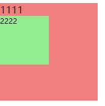
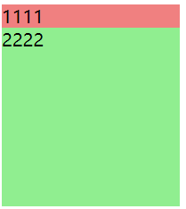
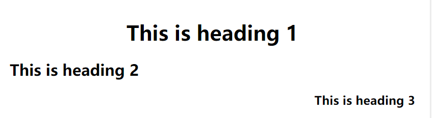

# 字体文本

## 相对字体大小


| 单位   | 相对于                                                       |
| :----- | :----------------------------------------------------------- |
| `em`   | 在 font-size 中使用是相对于父元素的字体大小，在其他属性中使用是相对于自身的字体大小，如 width |
| `ex`   | 字符“x”的高度                                                |
| `ch`   | 数字“0”的宽度                                                |
| `rem`  | 根元素的字体大小                                             |
| `lh`   | 元素的line-height                                            |
| `vw`   | 视窗宽度的1%                                                 |
| `vh`   | 视窗高度的1%                                                 |
| `vmin` | 视窗较小尺寸的1%                                             |
| `vmax` | 视图大尺寸的1%                                               |

em：

```html
<!DOCTYPE html>
<html lang="en">
<head>
    <meta charset="UTF-8">
    <meta http-equiv="X-UA-Compatible" content="IE=edge">
    <meta name="viewport" content="width=device-width, initial-scale=1.0">
    <title>Document</title>
    <style>
        .f{
            font-size: 16px;
            width: 160px;
            height: 160px;
            background-color: lightcoral;
        }
        .s{
            font-size: 0.5em;
            width: 10em;//相对于自己的font-size，
            height:10em;
            background-color: lightgreen;
        }
    </style>
</head>
<body>
    <div class="f">
        1111
        <div class="s">2222</div>
    </div>
</body>
</html>
```

结果：



rem：

```html
<!DOCTYPE html>
<html lang="en">
<head>
    <meta charset="UTF-8">
    <meta http-equiv="X-UA-Compatible" content="IE=edge">
    <meta name="viewport" content="width=device-width, initial-scale=1.0">
    <title>Document</title>
    <style>
        html{
            font-size: 20px;
        }
        .f{
            font-size: 1rem;
            width: 200px;
            height:10rem;
            background-color: lightcoral;
        }
        .s{
            font-size: 1rem;
            width: 10rem;
            height:10rem;
            background-color: lightgreen;
        }
    </style>
</head>
<body>
    <div class="f">
        1111
        <div class="s">2222</div>
    </div>
</body>
</html>
```

结果：



## font 字体属性

```css
p{
	font-size: 50px; 		/*字体大小*/
	line-height: 30px;      /*行高*/
	font-family: 幼圆,黑体; 	/*字体类型：如果没有幼圆就显示黑体，没有黑体就显示默认*/
	font-style: italic ;		/*italic表示斜体，normal表示不倾斜*/
	font-weight: bold;	/*粗体*/
	font-variant: small-caps;  /*小写变大写*/
}
```

如何让单行文本垂直居中

小技巧：如果一段文本只有一行，如果此时设置**行高 = 盒子高**，就可以保证单行文本垂直居中。

### vertical-align

`vertical-align`属性可用于指定**行内元素**（inline）、**行内块元素**（inline-block）、**表格的单元格**（table-cell）的垂直对齐方式。主要是用于图片、表格、文本的对齐。

vertical-align 的属性值可以归为以下4类

- **线类**，如 Baseline、Top、Middle、Bottom ；

- baseline 为 vertical-align 的默认值，其意思是指基线对齐

  

  

- middle 这个属性值用得比较多。

> 对于内联元素指的是元素的垂直中心点与行框盒子基线往上 1/2x-height 处对齐，简单点说就是字母 X 的中心位置对齐；对于 table-cell 元素，指的是单元格填充盒子相对于外面的表格行居中对齐。


### text-align

text-align 属性规定元素中的文本的水平对齐方式。

```
<style>
h1 {text-align:center}
h2 {text-align:left}
h3 {text-align:right}
</style>
```



### 文本属性

- `letter-spacing: 0.5cm ;`  单个字母之间的间距
- `word-spacing: 1cm;`   单词之间的间距
- `text-decoration: none;` 字体修饰：none 去掉下划线、**underline 下划线**、line-through 中划线、overline 上划线
- `color:red;` 字体颜色
- `text-align: center;` 在当前容器中的对齐方式。属性值可以是：left、right、center（<font color="#0000FF">**在当前容器的中间**</font>）、justify
- `text-transform: lowercase;` 单词的字体大小写。属性值可以是：`uppercase`（单词大写）、`lowercase`（单词小写）、`capitalize`（每个单词的首字母大写）

## overflow属性：超出范围的内容要怎么处理

`overflow`属性的属性值可以是：

- `visible`：默认值。多余的内容不剪切也不添加滚动条，会全部显示出来。

- `hidden`：不显示超过对象尺寸的内容。

- `auto`：如果内容不超出，则不显示滚动条；如果内容超出，则显示滚动条。

 - `scroll`：Windows 平台下，无论内容是否超出，总是显示滚动条。Mac 平台下，和 `auto` 属性相同。

# 背景

   ## background 的常见背景属性

**css2.1** 中，常见的背景属性有以下几种：（经常用到，要记住）

- `background-color:#ff99ff;`  设置元素的背景颜色。

- `background-image:url(images/2.gif);` 将图像设置为背景。

- `background-repeat: no-repeat;`  设置背景图片是否重复及如何重复，默认平铺满。（重要）

  - `no-repeat`不要平铺；
  - `repeat-x`横向平铺；
  - `repeat-y`纵向平铺。

- `background-position:center top;` **设置背景图片在当前容器中的位置。**

  background-position:向右偏移量 向下偏移量;background-position: 描述左右的词 描述上下的词;

- `background-attachment:scroll;` **设置背景图片是否跟着滚动条一起移动。**
  属性值可以是：`scroll`（与fixed属性相反，默认属性）、`fixed`（背景就会被固定住，不会被滚动条滚走）。

- 另外还有一个综合属性叫做`background`，它的作用是：将上面的多个属性写在一个声明中。

**CSS3** 中，新增了一些background属性：

- `background-origin`属性：控制背景从什么地方开始显示。

  ```css
  	/* 从 padding-box 内边距开始显示背景图 */
  	background-origin: padding-box;           //默认值
  
  	/* 从 border-box 边框开始显示背景图  */
  	background-origin: border-box;
  
  	/* 从 content-box 内容区域开始显示背景图  */
  	background-origin: content-box;
  ```

  

- `background-clip` 背景裁切

  ```css
   - `border-box` 超出 border-box 的部分，将裁剪掉
  
   - `padding-box` 超出 padding-box 的部分，将裁剪掉
  
   - `content-box` 超出 content-box 的部分，将裁剪掉
  ```

  

- `background-size` 调整尺寸

  ```css
  	/* 宽、高的具体数值 */
  	background-size: 500px 500px;
  
  	/* 宽高的百分比（相对于容器的大小） */
  	background-size: 50% 50%;   // 如果两个属性值相同，可以简写成：background-size: 50%;
  
  	background-size: 100% auto;  //这个属性可以自己试验一下。
  
  	/* cover：图片始终填充满容器，且保证长宽比不变。图片如果有超出部分，则超出部分会被隐藏。 */
  	background-size: cover;
  
  	/* contain：将图片完整地显示在容器中，且保证长宽比不变。可能会导致容器的部分区域为空白。  */
  	background-size: contain;
  ```

  

- 多重背景:我们可以给一个盒子同时设置多个背景，用以逗号隔开即可。可用于自适应局。

```html
<!DOCTYPE html>
<html>
<head lang="en">
    <meta charset="UTF-8">
    <title></title>
    <style>
        .box {
            height: 416px;
            border: 1px solid #000;
            margin: 100px auto;
            /* 给盒子加多个背景，按照背景语法格式书写，多个背景使用逗号隔开 */
            background: url(images/bg1.png) no-repeat left top,
            url(images/bg2.png) no-repeat right top,
            url(images/bg3.png) no-repeat right bottom,
            url(images/bg4.png) no-repeat left bottom,
            url(images/bg5.png) no-repeat center;
        }
    </style>
</head>
<body>
<div class="box"></div>
</body>
</html>
```

渐变：background-image 线性渐变、径向渐变

# 选择器

**基本选择器：**

-   标签选择器：针对**一类**标签
-   ID 选择器：针对某**一个**特定的标签使用
-   类选择器：针对**你想要的所有**标签使用
-   通用选择器（通配符）：针对所有的标签都适用（不建议使用）

**高级选择器：**

- 后代选择器：用空格隔开

- 交集选择器：选择器之间紧密相连

- 并集选择器（分组选择器）：用逗号隔开

- 伪类选择器

- 子代选择器，用符号`>`表示

- 兄弟选择器

  > 1. 选择器 +
  >
  > 　　如果需要选择紧接在另一个元素后的元素，而且二者有相同的父元素，可以使用相邻兄弟选择器。
  >
  > ２. 选择器~
  > 　　作用是查找某一个指定元素的后面的所有兄弟结点。

- 序选择器 https://blog.csdn.net/jwz934738949/article/details/88908132

  > 序选择器:
  >     css3中新增的选择器最具代表性的就是序选择器
  >     **1,同级别的第几个**
  >     :first-child 选中同级别中的第一个
  >     :last-child  选中同级别中的最后一个
  >     :nth-child(n) 选中同级别中的第n个
  >     :nth-last-child(n) 选中同级别中的倒数第n个
  >     :only-child 选中父元素中只有一个子元素的元素
  >     注意点:不区分类型
  >     **2,同类型的第几个**
  >     :first-of-type 选中同级别中同类型的第一个
  >     :last-of-type 选中同级别中同类型的最后一个
  >     :nth-of-type(n) 选中同级别中同类型的第n个
  >     :nth-last-of-type(n) 选中同级别中同类型的倒数第n个
  >     :only-of-type 选中父元素中子元素的类型只有一种的元素

-  属性选择器

  | 选择器                                                       | 例子                                              | 例子描述                                              |
  | :----------------------------------------------------------- | :------------------------------------------------ | :---------------------------------------------------- |
  | [[*attribute*\]](https://www.w3school.com.cn/cssref/selector_attribute.asp) | [target]                                          | 选择带有 target 属性的所有元素。                      |
  | [[*attribute*=*value*\]](https://www.w3school.com.cn/cssref/selector_attribute_value.asp) | [target=_blank]                                   | 选择带有 target="_blank" 属性的所有元素。             |
  | [[*attribute*~=*value*\]](https://www.w3school.com.cn/cssref/selector_attribute_value_contain.asp) | [title~=flower]                                   | 选择带有包含 "flower" 一词的 title 属性的所有元素。   |
  | [[*attribute*\|=*value*\]](https://www.w3school.com.cn/cssref/selector_attribute_value_start.asp) | [lang\|=en]                                       | 选择带有以 "en" 开头的 lang 属性的所有元素。          |
  | [[*attribute*^=*value*\]](https://www.w3school.com.cn/cssref/selector_attr_begin.asp) | a[href^="https"]                                  | 选择其 href 属性值以 "https" 开头的每个 <a> 元素。    |
  | [[*attribute*$=*value*\]](https://www.w3school.com.cn/cssref/selector_attr_end.asp) | a[href$=".pdf"] | 选择其 href 属性值以 ".pdf" 结尾的每个 <a> 元素。 |                                                       |
  | [[*attribute**=*value*\]](https://www.w3school.com.cn/cssref/selector_attr_contain.asp) | a[href*="w3school"]                               | 选择其 href 属性值包含子串 "w3school" 的每个 <a> 元素 |

# 伪类与伪元素

## 伪类（伪类选择器）

**伪类**：同一个标签，根据其**不同的种状态，有不同的样式**。这就叫做“伪类”。伪类用冒号来表示。


比如div是属于box类，这一点很明确，就是属于box类。但是a属于什么类？不明确。因为需要看用户点击前是什么状态，点击后是什么状态。所以，就叫做“伪类”。


伪类选择器分为两种。

（1）**静态伪类**：只能用于**超链接**的样式。如下：

- `:link` 超链接点击之前
- `:visited` 链接被访问过之后

PS：以上两种样式，只能用于超链接。

（2）**动态伪类**：针对**所有标签**都适用的样式。如下：

- `:hover` “悬停”：鼠标放到标签上的时候
- `:active`	“激活”： 鼠标点击标签，但是不松手时。
- `:focus` 是某个标签获得焦点时的样式（比如某个输入框获得焦点）

## 伪元素

css的`伪元素`，之所以被称为伪元素，是因为他们不是真正的页面元素，**html没有对应的元素**，但是其所有用法和表现行为与真正的页面元素一样，可以对其使用诸如页面元素一样的css样式，表面上看上去貌似是页面的某些元素来展现，实际上是css样式展现的行为，因此被称为伪元素。

# 继承性与层叠性

有一些属性，当给自己设置的时候，自己的后代都继承上了，这个就是**继承性。**

- **关于文字样式的属性，都具有继承性。这些属性包括：color、 text-开头的、line-开头的、font-开头的。**

- 关于盒子、定位、布局的属性，都不能继承。

**层叠性：就是css处理冲突的能力。** 

当多个选择器，选择上了某个元素的时候，要按照如下顺序统计权重：

-  id 选择器
-  类选择器、属性选择器、伪类选择器
-  标签选择器、伪元素选择器

- 1、对于相同的选择器（比如同样都是类选择器），其样式表排序：行级样式 > 内嵌样式表 > 外部样式表（就近原则）
- 2、对于相同类型的样式表（比如同样都是内部样式表），其选择器排序：ID选择器 > 类选择器 > 标签选择器
- 3、外部样式表的ID选择器  > 内嵌样式表的标签选择器

!important标记：优先级最高

# 盒模型

- width和height：**内容**的宽度、高度（不是盒子的宽度、高度）。
- padding：内边距。
- border：边框。
- margin：外边距。


`box-sizing: content-box|border-box|inherit:`

# 浮动

## 标准文档流

**（1）空白折叠现象：**

无论多少个空格、换行、tab，都会折叠为一个空格。

**（2）高矮不齐，底边对齐：**

**（3）自动换行，一行写不满，换行写。**

## 行内元素和块级元素

行内元素：

- 与其他行内元素并排；
- 不能设置宽、高。默认的宽度，就是文字的宽度。

块级元素：

- 霸占一行，不能与其他任何元素并列；
- 能接受宽、高。如果不设置宽度，那么宽度将默认变为父亲的100%。

**行内块元素(inline-block)：**结合的行内和块级的优点，既可以设置长宽，可以让padding和margin生效，又可以和其他行内元素并排。

互转: 利用display

## 浮动

### 性质

性质1：浮动的元素脱标,脱标即脱离标准流

**一旦一个元素浮动了，那么，将能够并排了，并且能够设置宽高了。无论它原来是个div还是个span。**所有标签，**浮动之后，已经不区分行内、块级了。**

性质2：浮动的元素互相贴靠

性质3：浮动的元素有“字围”效果

总结：**标准流中的文字不会被浮动的盒子遮挡住**。

性质4：收缩

收缩：一个浮动的元素，如果没有设置width，那么将自动收缩为内容的宽度（这点非常像行内元素）。

### 清除浮动(清除浮动带来的影响)

背景:两个父级div,都拥有浮动子级

**最优解:**

```css
.clearfix:after{
	content:" ";
	display:block;
	clear:both
}
```

#### 方法1：给浮动元素的祖先元素加高度

总结：

**如果一个元素要浮动，那么它的祖先元素一定要有高度。**

**有高度的盒子，才能关住浮动**。（记住这句过来人的经验之语）

只要浮动在一个有高度的盒子中，那么这个浮动就不会影响后面的浮动元素。所以就是清除浮动带来的影响了。

#### 方法2：clear:both;

`clear:both`的意思就是：**不允许左侧和右侧有浮动对象。**第二个父级div添加

**它所在的标签，margin属性失效了**,margin失效的本质原因是：上图中的box1和box2，高度为零。

#### 方法3：隔墙法,

*1.将父级中间加一个div:clear:both*

*2.“内墙法"  在第一个父级末尾加div:clear:both*

#### 方法4：overflow:hidden;overflow: auto;

只要给父亲加上`overflow:hidden`; 那么，父亲就能被儿子撑出高了。这是一个**偏方**。

# margin折叠

margin塌陷/margin重叠

标准文档流中，*竖直方向的margin不叠加*，取较大的值作为margin(*水平方向的margin是可以叠加的*，即水平方向没有塌陷现象)。

**相邻元素之间** 毗邻的两个元素之间的外边距会折叠（除非后一个元素需要清除之前的浮动）。

**父元素与其第一个或最后一个子元素之间** 如果在父元素与其第一个子元素之间不存在**边框**、**内边距**、**行内内容**，也没有创建**块格式化上下文**、或者**清除浮动**将两者的 margin-top 分开；或者在父元素与其最后一个子元素之间不存在边框、内边距、行内内容、height、min-height、max-height 将两者的 margin-bottom 分开，那么这两对外边距之间会产生折叠。此时子元素的外边距会“溢出”到父元素的外面。

从上面一段话总结下可以去除外边距折叠的方法：

1. 父元素添加边框(border)；
2. 父元素添加内边距(padding)；
3. 父子元素之间存在行内元素 `<span>` `匿名元素`；
4. 父子元素之间存在触发 BFC 的元素（插入一个 `display: flex` 的块级元素）；
5. 父元素触发 BFC（`overflow: auto;` 等）；

# BFC

**BFC(Block formatting context)直译为"块级格式化上下文"。它是一个独立的渲染区域**，只有Block-level box参与， 它规定了内部的Block-level Box如何布局，并且与这个区域外部毫不相干。

BFC就是页面上的一个隔离的独立容器，容器里面的子元素不会影响到外面的元素。反之也如此。

如何创建BFC

1、float的值不是none。
2、position的值是`absolute和fixed`
3、display的值是inline-block、table-cell、flex、table-caption或者inline-flex
4、overflow的值不是visible,`是auto和hidden`
5、html 根元素

总结：

- **浮动定位和清除浮动时只会应用于同一个 BFC 内的元素**，浮动不会影响其它 BFC 中元素的布局；
- **而清除浮动只能清除同一 BFC 中在它前面的元素的浮动**；
- **外边距折叠（Margin collapsing）也只会发生在属于同一 BFC 的块级元素之间**；
- **BFC就是页面上的一个隔离的独立容器，容器里面的子元素不会影响到外面的元素，反之亦然**；
- **计算BFC的高度时，考虑BFC所包含的所有元素，连浮动元素也参与计算**；
- **浮动盒区域不叠加到BFC上**；

# 定位

分别是绝对定位、相对定位、固定定位。


	position: absolute;  <!-- 绝对定位 --> 定位于有定位的祖先
	
	position: relative;  <!-- 相对定位 --> 定位于自己,微调
	
	position: fixed;     <!-- 固定定位 -->  相对浏览器窗口进行定位。无论页面如何滚动，这个盒子显示的位置不变。


**相对定位**：不脱标，老家留坑，**别人不会把它的位置挤走**。

**绝对定位:脱离了标准文档流。**

# 动画

[详细](../Web-master/02-CSS基础/12-CSS3属性详解：动画详解.md)

## 过渡：transition

可以实现元素**不同状态间的平滑过渡**（补间动画）

transition 包括以下属性：

- `transition-property: all;`  如果希望所有的属性都发生过渡，就使用all。

- `transition-duration: 1s;` 过渡的持续时间。

- `transition-timing-function: linear;`  运动曲线。属性值可以是：
  - `linear` 线性
  - `ease`  减速
  - `ease-in` 加速
  - `ease-out` 减速
  - `ease-in-out`  先加速后减速

- `transition-delay: 1s;` 过渡延迟。多长时间后再执行这个过渡动画。

上面的四个属性也可以写成**综合属性**：

```javascript
	transition: 让哪些属性进行过度 过渡的持续时间 运动曲线 延迟时间;

	transition: all 3s linear 0s;
```

其中，`transition-property`这个属性是尤其需要注意的，不同的属性值有不同的现象。

## 2D 转换 transform

**转换**是 CSS3 中具有颠覆性的一个特征，可以实现元素的**位移、旋转、变形、缩放**，甚至支持矩阵方式。

### 1、缩放：`scale`

格式：

```javascript
	transform: scale(x, y);

	transform: scale(2, 0.5);
```

参数解释： x：表示水平方向的缩放倍数。y：表示垂直方向的缩放倍数。如果只写一个值就是等比例缩放。

### 2、位移：`translate`

格式：


```javascript
	transform: translate(水平位移, 垂直位移);

	transform: translate(-50%, -50%);
```

参数解释：

- 参数为百分比，**相对于自身宽高**。不是父级!!!!!

- 正值：向右和向下。 负值：向左和向上。如果只写一个值，则表示水平移动。

### 3、旋转：`rotate`

格式：

```javascript
	transform: rotate(角度);

	transform: rotate(45deg);
```

参数解释：正值 顺时针；负值：逆时针。

如果想**改变旋转的坐标原点**，可以用`transform-origin`属性

### 4.倾斜: `skew`

```
transform:skew(<angle> [,<angle>]);
```

包含两个参数值，分别表示X轴和Y轴倾斜的角度，如果第二个参数为空，则默认为0，参数为负表示向相反方向倾斜。

- skewX(<angle>);表示只在X轴(水平方向)倾斜。
- skewY(<angle>);表示只在Y轴(垂直方向)倾斜。

###  5. 六合一:`matrix`

matrix()方法和2D变换方法合并成一个。

matrix 方法有六个参数，包含旋转，缩放，移动（平移）和倾斜功能。

## 3D 转换 transform

### 1、旋转：rotateX、rotateY、rotateZ

**格式：**

```javascript
	transform: rotateX(360deg);    //绕 X 轴旋转360度

	transform: rotateY(360deg);    //绕 Y 轴旋转360度

	transform: rotateZ(360deg);    //绕 Z 轴旋转360度

```

### 2、移动：translateX、translateY、translateZ

**格式：**

```javascript
	transform: translateX(100px);    //沿着 X 轴移动

	transform: translateY(360px);    //沿着 Y 轴移动

	transform: translateZ(360px);    //沿着 Z 轴移动

```
### 3. 缩放 

   | scaleX(*x*) | 定义 3D 缩放转换，通过给定一个 X 轴的值。 |
   | ----------- | ----------------------------------------- |
   | scaleY(*y*) | 定义 3D 缩放转换，通过给定一个 Y 轴的值。 |
   | scaleZ(*z*) | 定义 3D 缩放转换，通过给定一个 Z 轴的值。 |

### 4、透视：perspective

电脑显示屏是一个 2D 平面，图像之所以具有立体感（3D效果），其实只是一种视觉呈现，通过透视可以实现此目的。

定义 3D 转换元素的透视视图。**相当于定义元素距离人眼远近**

格式有两种写法：

- 作为一个属性，设置给父元素，作用于所有3D转换的子元素

- 作为 transform 属性的一个值，做用于元素自身。

格式举例：

```css
perspective: 500px;
```

### 5、3D呈现（transform-style）

3D元素构建是指某个图形是由多个元素构成的，可以给这些元素的**父元素**设置`transform-style: preserve-3d`来使其变成一个真正的3D图形。属性值可以如下：

transform-style: flat|preserve-3d;

相当于父元素设置为3D图形,父元素旋转了60度,那么子元素天生也得转了60度

| 值          | 描述                           |
| :---------- | :----------------------------- |
| flat        | 表示所有子元素在2D平面呈现。   |
| preserve-3d | 表示所有子元素在3D空间中呈现。 |

## 动画：animation

动画是CSS3中具有颠覆性的特征，可通过设置**多个节点** 来精确控制一个或一组动画，常用来实现**复杂**的动画效果。

### 1、定义动画的步骤

（1）通过`@keyframes`定义动画；

（2）将这段动画通过百分比，分割成**多个节点**；然后各节点中分别定义各属性；

（3）在指定元素里，通过 `animation` 属性调用动画。

之前,我们在 js 中定义一个函数的时候，是先定义，再调用：

```javascript
    js 定义函数：
        function fun(){ 函数体 }

     调用：
     	fun();
```

同样，我们在 CSS3 中**定义动画**的时候，也是**先定义，再调用**：

```javascript
    定义动画：
        @keyframes 动画名{
            from{ 初始状态 }
            to{ 结束状态 }
        }

     调用：
      animation: 动画名称 持续时间；
```

其中，animation属性的格式如下：

```javascript
            animation: 定义的动画名称 持续时间  执行次数  是否反向  运动曲线 延迟执行。(infinite 表示无限次)

            animation: move1 1s  alternate linear 3;

            animation: move2 4s;
```

**定义动画的格式举例：**

```html
<!DOCTYPE html>
<html>
<head lang="en">
    <meta charset="UTF-8">
    <title></title>
    <style>
        .box {
            width: 100px;
            height: 100px;
            margin: 100px;
            background-color: red;

            /* 调用动画*/
            /* animation: 动画名称 持续时间  执行次数  是否反向  运动曲线 延迟执行。infinite 表示无限次*/
            /*animation: move 1s  alternate linear 3;*/
            animation: move2 4s;
        }

        /* 方式一：定义一组动画*/
        @keyframes move1 {
            from {
                transform: translateX(0px) rotate(0deg);
            }
            to {
                transform: translateX(500px) rotate(555deg);
            }
        }

        /* 方式二：定义多组动画*/
        @keyframes move2 {
            0% {
                transform: translateX(0px) translateY(0px);
                background-color: red;
                border-radius: 0;
            }

            25% {
                transform: translateX(500px) translateY(0px);

            }

            /*动画执行到 50% 的时候，背景色变成绿色，形状变成圆形*/
            50% {
                /* 虽然两个方向都有translate，但其实只是Y轴上移动了200px。
                因为X轴的500px是相对最开始的原点来说的。可以理解成此时的 translateX 是保存了之前的位移 */
                transform: translateX(500px) translateY(200px);
                background-color: green;
                border-radius: 50%;
            }

            75% {
                transform: translateX(0px) translateY(200px);
            }

            /*动画执行到 100% 的时候，背景色还原为红色，形状还原为正方形*/
            100% {
                /*坐标归零，表示回到原点。*/
                transform: translateX(0px) translateY(0px);
                background-color: red;
                border-radius: 0;
            }
        }
    </style>
</head>
<body>
<div class="box">

</div>
</body>
</html>
```

注意好好看代码中的注释。

### 2、动画属性

我们刚刚在调用动画时，animation属性的格式如下：

animation属性的格式如下：

```javascript
            animation: 定义的动画名称  持续时间  执行次数  是否反向  运动曲线 延迟执行。(infinite 表示无限次)

            animation: move1 1s  alternate linear 3;

            animation: move2 4s;
```


可以看出，这里的 animation 是综合属性，接下来，我们把这个综合属性拆分看看。

（1）动画名称：

```javascript
	animation-name: move;
```

（2）执行一次动画的持续时间：

```javascript
	animation-duration: 4s;
```

备注：上面两个属性，是必选项，且顺序固定。

（3）动画的执行次数：

```javascript
	animation-iteration-count: 1;       //iteration的含义表示迭代
```

属性值`infinite`表示无数次。

（3）动画的方向：

```javascript
	animation-direction: alternate;
```

属性值：normal 正常，alternate 反向。

（4）动画延迟执行：


```javascript
	animation-delay: 1s;
```

（5）设置动画结束时，盒子的状态：

```javascript
	animation-fill-mode: forwards;
```

属性值： forwards：保持动画结束后的状态（默认），  backwards：动画结束后回到最初的状态。

（6）运动曲线：  

```
	animation-timing-function: ease-in;
```

属性值可以是：linear   ease-in-out  steps()等。

注意，如果把属性值写成**` steps()`**，则表示动画**不是连续执行**，而是间断地分成几步执行。我们接下来专门讲一下属性值 `steps()`。

我们还是拿上面的例子来举例，如果在调用动画时，我们写成：


```javascript
	animation: move2 4s steps(2);
```


# Flex

http://www.ruanyifeng.com/blog/2015/07/flex-grammar.html

## 一、Flex 布局是什么？

Flex 是 Flexible Box 的缩写，意为"弹性布局"，用来为盒状模型提供最大的灵活性。

任何一个容器都可以指定为 Flex 布局。

> ```css
> .box{
>   display: flex;
> }
> ```

行内元素也可以使用 Flex 布局。

> ```css
> .box{
>   display: inline-flex;
> }
> ```

Webkit 内核的浏览器，必须加上`-webkit`前缀。

> ```css
> .box{
>   display: -webkit-flex; /* Safari */
>   display: flex;
> }
> ```

注意，设为 Flex 布局以后，子元素的`float`、`clear`和`vertical-align`属性将失效。

## 二、基本概念

采用 Flex 布局的元素，称为 Flex 容器（flex container），简称"容器"。它的所有子元素自动成为容器成员，称为 Flex 项目（flex item），简称"项目"。


容器默认存在两根轴：水平的主轴（`main axis`）和垂直的交叉轴（cross axis）。主轴的开始位置（与边框的交叉点）叫做`main start`，结束位置叫做`main end`；交叉轴的开始位置叫做`cross start`，结束位置叫做`cross end`。

项目默认沿主轴排列。单个项目占据的主轴空间叫做`main size`，占据的交叉轴空间叫做`cross size`。

## 三、容器的属性

以下6个属性设置在容器上。

> - **flex-direction:决定主轴的方向**
> - flex-wrap:如何换行
> - flex-flow:上两个的合写
> - **justify-content:(一行)项目在主轴上的对齐方式**
> - **align-items:(一行)项目在交叉轴上如何对齐**
> - align-content:行与行之间的对齐方式

### 3.1 flex-direction属性

`flex-direction`属性决定主轴的方向（即项目的排列方向）。

> ```css
> .box {
>   flex-direction: row | row-reverse | column | column-reverse;
> }
> ```


它可能有4个值。

> - `row`（默认值）：主轴为水平方向，起点在左端。
> - `row-reverse`：主轴为水平方向，起点在右端。
> - `column`：主轴为垂直方向，起点在上沿。
> - `column-reverse`：主轴为垂直方向，起点在下沿。

### 3.2 flex-wrap属性

默认情况下，项目都排在一条线（又称"轴线"）上。`flex-wrap`属性定义，如果一条轴线排不下，如何换行。


> ```css
> .box{
>   flex-wrap: nowrap | wrap | wrap-reverse;
> }
> ```

它可能取三个值。

（1）`nowrap`（默认）：不换行。


（2）`wrap`：换行，第一行在上方。


（3）`wrap-reverse`：换行，第一行在下方。


### 3.3 flex-flow

`flex-flow`属性是`flex-direction`属性和`flex-wrap`属性的简写形式，默认值为`row nowrap`。

> ```css
> .box {
>   flex-flow: <flex-direction> || <flex-wrap>;
> }
> ```

### 3.4 justify-content属性

`justify-content`属性定义了项目在主轴上的对齐方式。

> ```css
> .box {
>   justify-content: flex-start | flex-end | center | space-between | space-around;
> }
> ```


它可能取5个值，具体对齐方式与轴的方向有关。下面假设主轴为从左到右。

> - `flex-start`（默认值）：左对齐
> - `flex-end`：右对齐
> - `center`： 居中
> - `space-between`：两端对齐，项目之间的间隔都相等。
> - `space-around`：每个项目两侧的间隔相等。所以，项目之间的间隔比项目与边框的间隔大一倍。

### 3.5 align-items属性

`align-items`属性定义项目在交叉轴上如何对齐。

> ```css
> .box {
>   align-items: flex-start | flex-end | center | baseline | stretch;
> }
> ```


它可能取5个值。具体的对齐方式与交叉轴的方向有关，下面假设交叉轴从上到下。

> - `flex-start`：交叉轴的起点对齐。
> - `flex-end`：交叉轴的终点对齐。
> - `center`：交叉轴的中点对齐。
> - `baseline`: 项目的第一行文字的基线对齐。
> - `stretch`（默认值）：如果项目未设置高度或设为auto，将占满整个容器的高度。

### 3.6 align-content属性

`align-content`属性定义了多根轴线的对齐方式。如果项目只有一根轴线，该属性不起作用。

> ```css
> .box {
>   align-content: flex-start | flex-end | center | space-between | space-around | stretch;
> }
> ```


该属性可能取6个值。

> - `flex-start`：与交叉轴的起点对齐。
> - `flex-end`：与交叉轴的终点对齐。
> - `center`：与交叉轴的中点对齐。
> - `space-between`：与交叉轴两端对齐，轴线之间的间隔平均分布。
> - `space-around`：每根轴线两侧的间隔都相等。所以，轴线之间的间隔比轴线与边框的间隔大一倍。
> - `stretch`（默认值）：轴线占满整个交叉轴。

## 四、项目的属性

以下6个属性设置在项目上。

> - `order`
> - `flex-grow`
> - `flex-shrink`
> - `flex-basis`
> - `flex`
> - `align-self`

### 4.1 order属性

`order`属性定义项目的排列顺序。数值越小，排列越靠前，默认为0。

> ```css
> .item {
>   order: <integer>;
> }
> ```


### 4.2 flex-grow属性

`flex-grow`属性定义项目的放大比例，默认为`0`，**即如果存在剩余空间，也不放大**。

> ```css
> .item {
>   flex-grow: <number>; /* default 0 */
> }
> ```


如果所有项目的`flex-grow`属性都为1，则它们将等分剩余空间（如果有的话）。如果一个项目的`flex-grow`属性为2，其他项目都为1，*则前者占据的剩余空间将比其他项多一倍。*

### 4.3 flex-shrink属性

`flex-shrink`属性定义了项目的缩小比例，默认为1，即如果空间不足，该项目将缩小。

> ```css
> .item {
>   flex-shrink: <number>; /* default 1 */
> }
> ```


如果所有项目的`flex-shrink`属性都为1，当空间不足时，都将等比例缩小。如果一个项目的`flex-shrink`属性为0，其他项目都为1，则空间不足时，前者不缩小。

负值对该属性无效。

### 4.4 flex-basis属性

`flex-basis`属性定义了在分配多余空间之前，项目占据的主轴空间（main size）。浏览器根据这个属性，计算主轴是否有多余空间。它的默认值为`auto`，即项目的本来大小。

> ```css
> .item {
>   flex-basis: <length> | auto; /* default auto */
> }
> ```

它可以设为跟`width`或`height`属性一样的值（比如350px），则项目将占据固定空间。

### 4.5 flex属性

`flex`属性是`flex-grow`, `flex-shrink` 和 `flex-basis`的简写，默认值为`0 1 auto`。后两个属性可选。

> ```css
> .item {
>   flex: none | [ <'flex-grow'> <'flex-shrink'>? || <'flex-basis'> ]
> }
> ```

该属性有两个快捷值：`auto` (`1 1 auto`) 和 none (`0 0 auto`)。

建议优先使用这个属性，而不是单独写三个分离的属性，因为浏览器会推算相关值。

### 4.6 align-self属性

`align-self`属性允许单个项目有与其他项目不一样的对齐方式，可覆盖`align-items`属性。默认值为`auto`，表示继承父元素的`align-items`属性，如果没有父元素，则等同于`stretch`。

> ```css
> .item {
>   align-self: auto | flex-start | flex-end | center | baseline | stretch;
> }
> ```


该属性可能取6个值，除了auto，其他都与align-items属性完全一致。

# 常见面试题

## 隐藏盒子的几种方式

（1）方式一：

```
overflow：hidden;   //隐藏盒子超出的部分
```


（2）**方式二**：

```
display: none;	  隐藏盒子，而且不占位置(用的最多)
```

比如，点击`X`，关闭京东首页上方的广告栏。

（3）方式三：

```
visibility: hidden;   //隐藏盒子，占位置。
visibility: visible;   //让盒子重新显示

```

（4）方式四：

```
opacity: 0;       //设置盒子的透明度（不建议，因为内容也会半透明），占位置
```


（4）方式五：

```
Position/top/left/...-999px   //把盒子移得远远的，占位置。
```

（5）方式六：

```
margin-left: 1000px;
```

## 行内元素居中

### 行内元素水平居中

给父容器设置：

```
    text-align: center;

```

### 行内元素垂直居中

让**文字的行高** 等于 **盒子的高度**，可以让单行文本垂直居中。比如：

```css
    .father {
        height: 20px;
        line-height: 20px;
    }
```

或vertical-align:middle

## 块级元素水平垂直居中

### margin: auto 的问题

如果要对一个元素**垂直居中**，`margin: auto`就行不通了。

### 绝对定位 + translate（无需指定子元素的宽高，推荐）

```css
.father{
            position: relative;
            min-height: 500px;
            background: pink;
        }
        .son {
            position: absolute;
            background: red;
            top: 50%;
            left: 50%;
            transform: translate(-50%, -50%);
        }
```

### 方式3：flex 布局

```
.father{
            display: flex;
            justify-content: center;
            align-items: center;
            min-height: 100vh;
            background: pink;
        }
        .son {
            background: red;
        }
```

###  flex 布局 + margin: auto（推荐）

我们只需写两行声明即可：先给父容器设置 `display: flex`，再给指定的子元素设置我们再熟悉不过的 `margin: auto`，即可让这个指定的子元素在**剩余空间**里，水平垂直居中。大功告成。

代码举例：

```html
<!DOCTYPE html>
<html lang="en">
<head>
    <meta charset="UTF-8">
    <meta name="viewport" content="width=device-width, initial-scale=1.0">
    <title>Document</title>
    <style>
        * {
            margin: 0;
            padding: 0;
        }
        .father{
            display: flex;
            min-height: 100vh;
            background: pink;
        }
        .son {
            margin: auto;
            background: red;
        }
    </style>
</head>
<body>
    <div class="father">
        <div class="son">子元素的内容，想水平垂直居中</div>
        <div class="son2">这个元素不想水平垂直居中</div>
    </div>
    <script></script>
</body>
</html>
```

请注意，当我们给父容器使用 Flex 布局 时，子元素的`margin: auto`不仅能让其在水平方向上居中，**垂直方向上也是居中的**。
