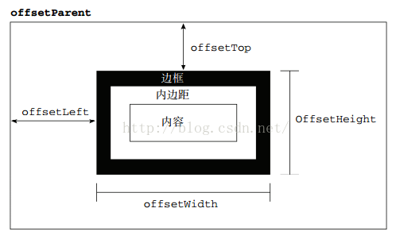
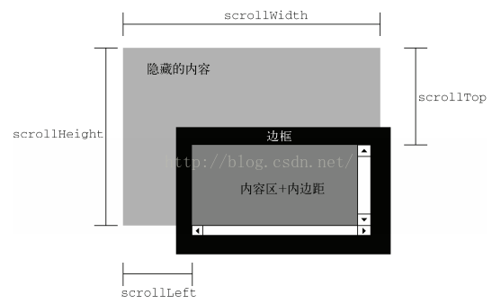
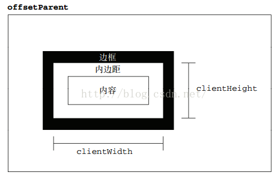
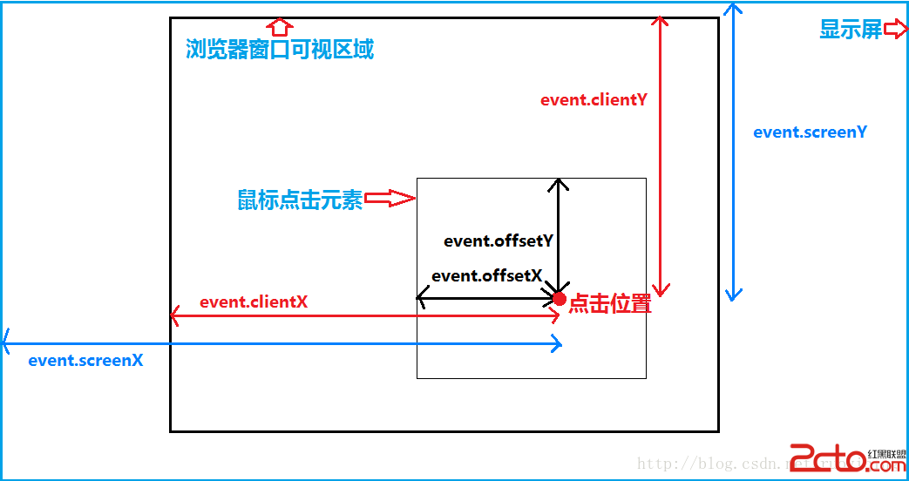

# [offset,scroll,client三大系列](https://www.cnblogs.com/huihuihero/p/10801062.html)

pageX/pageY:
鼠标相对于整个页面的X/Y坐标。
注意，整个页面的意思就是你整个网页的全部，比如说网页很宽很长，宽2000px，高3000px，那pageX,pageY的最大值就是它们了。
特别说明：IE不支持！
clientX/clientY：
事件发生时鼠标在浏览器内容区域的X/Y坐标（不包含滚动条）。
浏览器内容区域即浏览器窗口中用来显示网页的可视区域，注意这个可视，也就是说需要拖动滚动条才能看到的区域不算。
当你将浏览器窗口缩小时，clientX/clientY的最大值也会缩小，但始终，它们的最大值不会超过你浏览器可视区域。
特别说明：IE下此属性不规范，它们的最小值不是0而是2，也就是说IE下的clientX/clientY比火狐下始终大2px。
screenX/screenY
鼠标在屏幕上的坐标。screenX,screenY的最大值不会超过屏幕分辨率。
————————————————
版权声明：本文为CSDN博主「ajaxuser」的原创文章，遵循CC 4.0 BY-SA版权协议，转载请附上原文出处链接及本声明。
原文链接：https://blog.csdn.net/ajaxuser/article/details/7549661

#### offset 偏移

- offsetWidth是指div的宽度（包括div的边框）
  `offsetWidth = width + padding + border；`
- offsetHeight是指div的高度（包括div的边框）
  `offsetHeight = Height + padding + border；`
- offsetLeft是指div到整个页面左边框的距离（不包括div的边框）
- offsetTop是指div到整个页面上边框的距离（不包括div的边框）

#### scroll     滚动

- scrollTop是指可视区顶部边框与整个页面上部边框的看不到的区域。
- scrollLeft是指可视区左边边框与整个页面左边边框的看不到的区域。
- scrollWidth是指左边看不到的区域加可视区加右边看不到的区域即整个页面的宽度（包括边框）
- scrollHeight是指上边看不到的区域加可视区加右边看不到的区域即整个页面的高度（包括边框）

#### client  可视区、客户端

- event.clientX是指鼠标到可视 。
- event.clientY是指鼠标到可视区上边框的距离。
- clientWidth是指可视区的宽度。(内容区+内边距，不包括边框)
- clientHeight是指可视区的高度。(内容区+内边距，不包括边框)
- clientTop和clientLeft 几乎不用，因为滚动条不会在顶部和左侧

#### x , y

- clientX、clientY（视口）
  点击位置距离当前body可视区域的x，y坐标
- pageX、pageY（整个页面）
  对于整个页面来说，包括了被卷去的body部分的长度
- screenX、screenY（显示器）
  点击位置距离当前电脑屏幕的x，y坐标
- offsetX、offsetY（父亲）
  相对于带有定位的父盒子的x，y坐标

- 

#### 区别

**width,height**
clientWidth = width + padding
clientHeight = height + padding
offsetWidth = width + padding + border
offsetHeight = height + padding + border
scrollWidth = 内容宽度（不包含border）
scrollHeight = 内容高度（不包含border）

**top,left**
offsetTop/offsetLeft ：
调用者：任意元素。(盒子为主)
作用：距离父系盒子中带有定位的距离。
scrollTop/scrollLeft:(盒子也可以调用，必须有滚动条)
调用者：document.body.scrollTop/.....(window)
作用：浏览器无法显示的部分（被卷去的部分）
clientY/clientX:（clientTop/clientLeft 值的是border）
调用者：event.clientX(event)
作用：鼠标距离浏览器可视区域的距离（左、上）